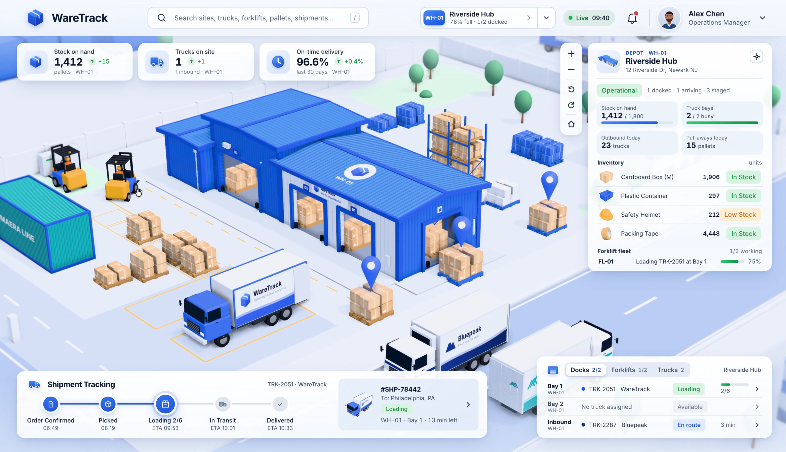
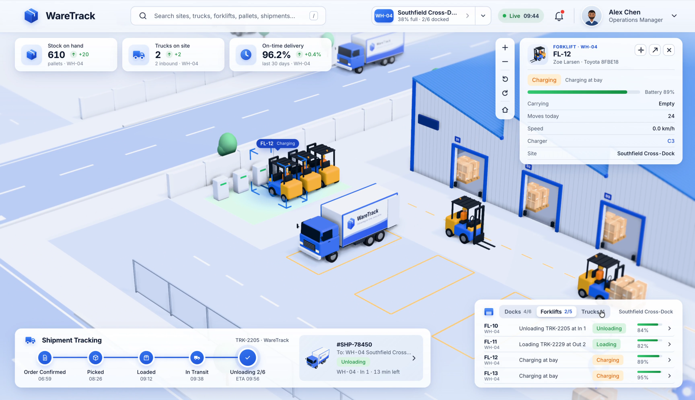
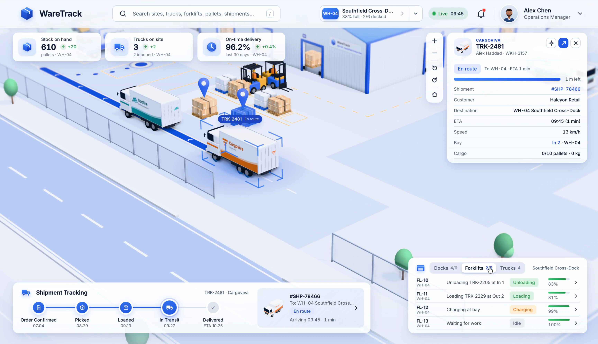
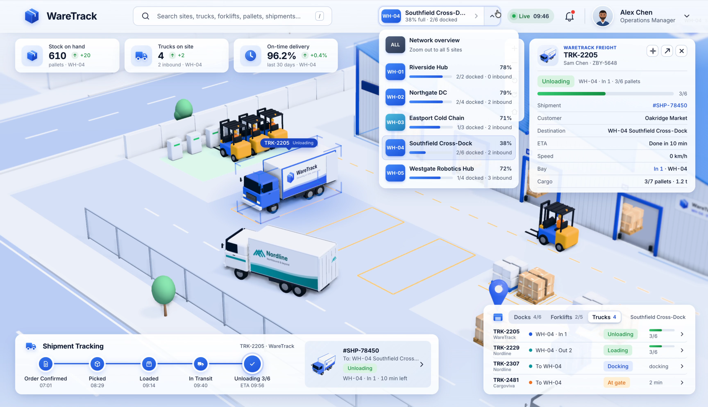
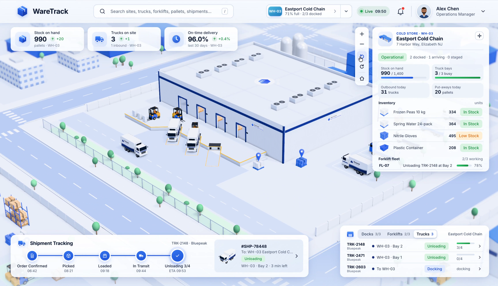
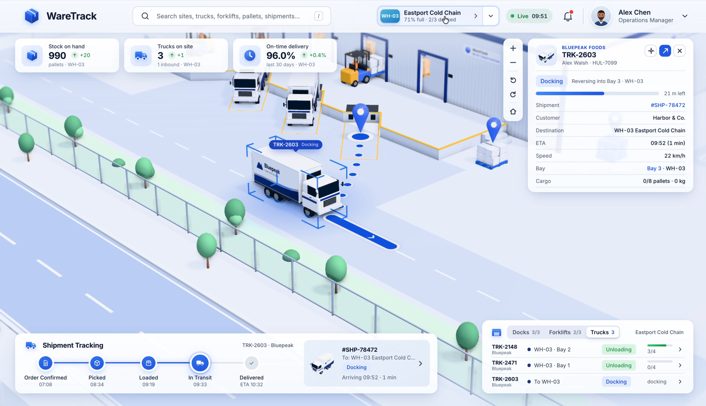

# 视频截图视觉参考

这些画面来自用户提供的视频，供 Lab Word 工作台的布局与信息层级设计参考。完整画面保留原有界面，截图没有裁切、遮挡或添加标注。

重点观察：空间占据主要工作面，信息区靠边布局；选择对象后展示上下文详情；底部显示任务阶段；场景切换和取景保持清晰。图中的对象、业务数据和操作不构成 Lab Word 的功能需求，正式范围以 [规格 #23](https://github.com/CaiZongyuan/labworld/issues/23) 为准。

原视频：相邻目录中的 `DilumSanjaya-2106426962738880879-01.mp4`。该视频保留在本地；本分支发布截图和时间点，便于其他开发者直接查看。每张 PNG 为原始 3456 × 1990 分辨率。时间点、源文件与截图哈希见 [manifest.json](manifest.json)。

| 截图                                         | 时间点  | 观察重点                                   |
| -------------------------------------------- | ------- | ------------------------------------------ |
| [01 · 空间总览](01-spatial-overview.png)     | 00:01.2 | 场景主工作面、顶部摘要、边缘详情与底部任务 |
| [02 · 对象详情](02-object-detail.png)        | 00:19.3 | 选中对象、状态与上下文详情                 |
| [03 · 任务摘要](03-task-summary.png)         | 00:25.3 | 底部阶段条、任务与对象状态的关联           |
| [04 · 场景切换](04-context-switcher.png)     | 00:31.3 | 场景选择与可展开目录                       |
| [05 · 拉远取景](05-overview-distance.png)    | 00:49.4 | 全局空间结构与统一物体比例                 |
| [06 · 选中关系](06-selected-object-path.png) | 00:55.4 | 选择强调与空间位置关系                     |

## English

These full-resolution still frames come from the user-provided video. Use them to inspect the scene layout, edge panels, contextual object details, task stages and camera framing. They are uncropped and have no added annotations. Objects and workflows shown in these images are visual references; [spec #23](https://github.com/CaiZongyuan/labworld/issues/23) defines Lab Word's feature scope.

The source video remains local. The published branch contains the six PNG images, their timestamps and hashes. Each image is 3456 × 1990 pixels. The table above links to all frames in timestamp order.

## 截图 / Frames

### 01 · 空间总览 / Spatial Overview · 00:01.2



### 02 · 对象详情 / Object Detail · 00:19.3



### 03 · 任务摘要 / Task Summary · 00:25.3



### 04 · 场景切换 / Context Switcher · 00:31.3



### 05 · 拉远取景 / Overview Distance · 00:49.4



### 06 · 选中关系 / Selected Object Path · 00:55.4



## 重新提取 / Re-extract

在具有原视频和仓库依赖的本地工作副本中，从仓库根目录运行以下命令。该命令更新本目录内的 PNG 与 manifest。

From the repository root, run this command in a checkout that has the original local video and repository dependencies. It updates the PNG images and manifest in this directory.

```bash
node .scratch/design/ref/extract-frames.mjs
```
