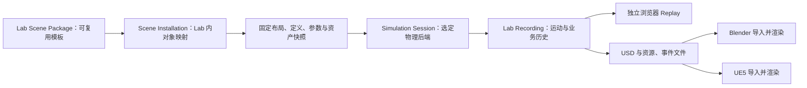

# 物理仿真接入与实验回放计划

状态：设计已确认。用户在 2026-10-10 的 grill-with-docs 访谈中确认 Q1–Q29。具体生产引擎按 M0 的实测结果定案，首版交付一个后端。本文件记录目标行为与验收；当前已有能力见下文基线。

领域定义见 [CONTEXT](../../CONTEXT.md)，重要取舍见 [ADR 0012](../adr/0012-newton-scene-templates-and-independent-replay.md)。本文件路径保留 `newton-backend.md`，便于已有引用继续使用。

## 1. 目标与首版范围

在本地物理仿真中运行 SO-101 抓取并放置试管。Lab Word 能控制、观察并自动录制这次实验。关闭仿真与 Lab Word Server 后，浏览器仍能独立回放；同一录制可导出到 Blender 与 UE5，导入后渲染图像序列或视频。

| 首版交付 | 行为 |
| --- | --- |
| 实验场景 | 一台 SO-101、一支试管、四孔架、垫面，补实验台外观。 |
| 本地仿真 | 优先验证 WSL Ubuntu 上现有 kitless Isaac Lab + Newton/MJWarp 场景；必要时加入 MuJoCo CPU 对照。无需启动 Isaac Sim Kit。 |
| 机器人动作 | Home、关节目标、夹爪开合、预定义 Pick & Place，以及明确的任务取消。 |
| 物理真实性 | 抓取与搬运依靠接触；未夹住、滑落和未放稳必须有失败结果。允许预定义关节轨迹。 |
| 共享会话 | 每个 Lab 最多一个活动 Simulation Session；多个浏览器观察同一会话。 |
| 实验录制 | 一会话一录制；包含初始快照、运动、命令、观测、任务状态转换和结果。 |
| 浏览器 Replay | 本地工作台查看自己的录制；公开入口播放已发布示例。播放、暂停、拖动时间轴和 Inspector 均使用历史数据。 |
| 外部渲染 | 导出 USD 与资源、事件文件，在 Blender 和 UE5 中分别导入并渲染。 |
| 公开 Demo | 发布显式生成的静态演示副本，优先使用 Cloudflare 静态托管；部署时核对实际限额和资源大小。 |

后续范围包括：远程实时控制、显微镜和离心机扩展、任意目标规划、训练策略接入、实验参数随机化、浏览器本地 Device Program、公开页面任意文件导入，以及由 Lab Word 自动调用渲染器生成视频。桌面 Web 是本轮界面范围。

## 2. 已核实的实现基线

| 范围 | 当前事实 | 新工作 |
| --- | --- | --- |
| Lab 与身份 | 已有持久 Lab、Entity、Scene Node、版本化定义及布局。 | 场景模板安装、稳定对象映射与升级差异。 |
| 设备运行 | 已有照明、温度与离心程序；Device Program Run 属于单个 Entity。 | 跨对象 Simulation Session 与物理执行适配。 |
| 机器人 | 目录声明机器人能力，当前运行绑定未实现机器人动作。 | 关节、夹爪、轨迹控制与接触结果验证。 |
| 资产 | 当前持久 Asset Representation 对 asset_id 有唯一约束。 | 明确 Web 与物理/渲染表示的关联及兼容迁移；不能假定多表示已实现。 |
| 历史 | 已有 Command、Observation、Task 和事件；普通列表返回当前或最终行状态。 | 独立采集逐时刻状态转换，不能靠事后扫描列表恢复完整实验。 |
| 观测 | 历史报告为逐属性增量；无值显示 unknown，过期值保留“最后报告”。 | 初始逐属性快照与历史时间重建。 |
| 文件 | Core 已有按 ownerType/ownerId 的 pin/release 和引用保护。 | Recording 对内容、资源及精确版本的正式消费关系。 |
| 浏览器 | Lab 页面目前依赖服务器身份与 API；GLB 显示有居中和底边对齐处理。 | 独立只读播放器与物理原点映射；不能把当前显示根节点直接当物理原点。 |

当前代码与产品范围见 [架构](../architecture/lab-word.md)。关键来源为 [设备运行](../../packages/server/src/lab/devices/runtime.ts)、[历史列表](../../packages/server/src/lab/records/list.sql)、[观测显示](../../packages/views/src/lab/observation-state.ts)、[场景显示](../../packages/views/src/lab/world-viewport.tsx)及 [Core 文件服务](../../packages/server/src/core/files/use-cases.ts)。

已有物理场景位于仓库外的 Windows 项目 `D:\Projects\Robots\IsaacLabTutorial`，WSL 路径为 `/mnt/d/Projects/Robots/IsaacLabTutorial`。它使用 Isaac Lab 3.0 的 kitless Newton MJWarp 路径，包含 SO-101、试管、四孔架、垫面、接触判据与关节轨迹素材。已有运行记录，本次文档工作未重新执行抓取。

该项目 Windows 虚拟环境元数据为 Newton 1.6.0rc1、Warp 1.17.0、MuJoCo 3.12.0、Isaac Lab 3.0.0。当前主机为 WSL2 Ubuntu 24.04.4、Python 3.12.3、RTX 3070 Ti Laptop 8 GB，驱动查询为 610.62；WSL Python 尚未安装同等仿真环境。

教程代码为 Apache-2.0，Isaac Lab 的 SO-101 配置源码为 BSD-3-Clause。其引用的 USD、纹理与其他资源许可和完整离线依赖仍需核对，代码许可不代表资产许可。原场景引用 Nucleus 资产，不能视为已经可离线分发的场景包。

## 3. 引擎与平台的定案方法

Newton 官方支持 Linux，NVIDIA 支持 WSL2 CUDA；这些来源支持将 WSL Ubuntu 作为验证路径。所查 Newton 平台矩阵没有单独列出 WSL，驱动查询也不代替实际求解。

Newton 1.6 的 SolverMuJoCo 可以使用 MJWarp，或通过 `use_mujoco_cpu=True` 使用 MuJoCo-C CPU 后端。因此候选是：

1. 复用 kitless Isaac Lab + Newton/MJWarp，先建立 WSL 单环境基线。
2. 必要时保留 Newton 模型层，评估 MuJoCo CPU 求解；当前 Isaac Lab 封装是否直接支持切换尚未核实。
3. 必要时评估原生 MuJoCo CPU；现有 USD 场景与控制逻辑需要适配，不能当作现成 MJCF 直接替换。

比较固定初始条件下的抓取正确性、交互表现、启动/JIT 与资源开销、资产适配和维护成本。记录参数语义差异，避免把不同工作量的结果当作速度排名。首版不做批量训练，也不要求交付三个后端。普通 Lab Word 启动与已有平台支持继续独立于可选仿真环境。

完整官方来源、固定版本与实验方法见 [引擎调查](../research/2026-10-10-newton-mujoco-wsl.md)。

## 4. 对象、权威状态与模块边界

| 信息 | 权威来源 | 边界 |
| --- | --- | --- |
| Lab、Entity、定义、关系与保存布局 | Lab Word Server | 位姿流不修改 Registered Location，也不覆盖保存布局。 |
| 碰撞、质量、关节与初始参数 | 固定版本场景包和会话快照 | 本次运行使用有效参数，记录实际配置。 |
| 实时物理位姿、关节、接触 | 活动仿真后端 | 带会话及来源身份，桥接层验证后使用。 |
| 命令受理、权限、幂等与任务记录 | Lab Word Server | Command 接受、执行结果与 Observation 分别表达。 |
| 已发生过程 | Lab Recording | 实验事实由录制提供，播放器和渲染器重现它。 |
| 视觉呈现 | 浏览器、Blender、UE5 | 使用明确坐标映射；材质、灯光和相机可分别配置。 |

Core 继续拥有身份、访问、文件与通用审计；Lab 拥有安装、会话、动作、录制及回放含义。仿真桥接拥有物理对象解析、目标控制与来源报告。回放读取录制，渲染导出转换录制；它们无需启动物理求解器。

模拟与真实 Entity 继续分开，沿用 [ADR 0007](../adr/0007-separate-simulated-and-physical-entity-identities.md)。现有 Device Program Run 保留单设备含义。首版每个 Simulation Session 只运行一个 Scene Installation 的绑定对象集合；其他 Lab 对象保持已有行为，三维显示本身不让它们参与碰撞。

业务通道沿用受控命令、观测与历史合同。高频运动独立传输和录制，不逐帧写入 PGlite。物理步长、控制周期、可视化更新与录制采样分别记录；具体频率和文件编码由先导结果及后续接口规格确定。来源准入、权限和会话隔离同样适用于运动通道。

## 5. 场景包、安装与更新

场景包组织版本化对象定义、资产表示、初始空间关系、物理引用、关节与可视化映射，以及来源和许可。包内对象 Key 稳定，Entity UUID 属于具体安装。不同 Lab 或新安装创建独立 Entity，更新原安装保留相同 Key 的身份。

静态对象可以没有控制 Capability 或 Runtime Binding。物理引用使用稳定路径和名称；运行时解析的 body index 不成为持久身份。能力声明、绑定实现和当前可执行性保持独立，清单中的动作字符串不等于已有执行支持。

首次导入和发布必须核对单位、轴向、手性、父子变换、模型原点与连杆原点。Three.js、物理场景和 USD 导出都使用明确转换；当前 GLB 自动居中处理需要纳入映射。

更新在空闲时显示差异并显式应用：相同 Key 保留身份，新 Key 创建对象，移除项由用户决定归档。保留安装中的已有布局修改并提示冲突。原始文件或场景包更新不自动覆盖 Lab；历史录制继续引用原版本。

## 6. 会话、动作与时间

Lab Word Server 使用明确配置的 Python 环境启动并监管桥接进程。启动固定安装版本、对象映射、保存布局、资产、初始状态和参数；停止后回收本会话拥有的进程与临时资源。

| 操作或事件 | 会话与任务行为 | 录制行为 |
| --- | --- | --- |
| Start | 从当前保存的安装与布局创建新会话。 | 创建新录制并保存初始快照。 |
| Pause / Resume | 暂停冻结仿真时间和任务进度，保留现场；恢复后继续。 | 保留暂停/恢复事件及真实时间，运动时间轴按仿真时间推进。 |
| Home / 关节目标 / 夹爪 / Pick & Place | 按能力与状态检查受理；同一机器人在途任务拒绝冲突动作。 | 分别记录命令与实际观测、阶段和结果。 |
| Cancel | 明确关联当前任务；取消受理和取消结束分别表达。 | 保存取消过程与已确认结果。 |
| Reset | 取消在途任务，结束旧会话，从原会话初始快照创建新会话；不应用运行期间保存的新布局。 | 结束旧录制，创建新录制，时间不在同一记录内倒退。 |
| 结束后重新 Start | 使用最新保存的安装与布局。 | 创建新的版本与初始状态快照。 |
| 服务或仿真异常退出 | 会话及在途任务中断，不确定命令保持未知；显式启动新会话。 | 保留有效片段并标明中断与缺口。 |
| 录制写入失败 | 停止会话，在途任务中断；已确认完成的任务保留原结果。 | 标明失败，保留已经写入的有效片段。 |

首版预定义任务使用经过物理验收的固定初态、参数组、seed 与关节轨迹，记录实际求解配置。原训练场景的质量、摩擦及起始阶段随机化不作为首版默认行为。任务成功由接触、提起、搬运、释放及稳定放置的已验证判据确认，不能通过固定试管到夹爪上或仅检查目标指令来确认。

会话保存仿真时间和真实审计时间。事件具有明确顺序，暂停期间相同仿真时间的多条事件仍可区分。播放使用录制中的时间映射，不能使用今天的墙钟或当前连接状态判断历史观测。

## 7. 录制、历史状态与缺口

| 录制内容 | 用途 |
| --- | --- |
| 初始快照 | 精确场景与定义版本、对象映射、资产校验值、布局、关节与物体初态、初始逐属性状态。 |
| Motion Track | 实际采样时间、连杆及自由刚体位姿、关节值，重现已发生运动。 |
| Command Track | 动作受理、执行与结果事件，区分意图和实际状态。 |
| Observation Track | 逐属性增量、值、单位、来源、时间、质量与时效信息。 |
| Task Track | 开始、阶段、进度、取消、完成、失败和中断的状态转换。 |
| Metadata | 会话、采样、实际参数、seed、求解器与依赖版本，完整性及有效范围。 |

录制在会话中采集，不能事后仅从有限期历史拼装。普通 Task 列表中的最终状态不能放回创建时刻，例如第 5 秒完成的任务在第 2 秒仍应显示执行中。

播放器从初始快照与状态转换重建播放时刻的 Inspector。属性缺少前序值时显示 unknown，不能填 0 或借用未来值。过期值保留最后报告，并按录制的历史时间说明来源与时效。回放不改变当前设备状态，也不执行历史命令。

只在同一有效连续片段内插值。缺口在时间轴中显式标记，播放到缺口暂停，用户可以跳到下一有效片段；不能跨缺口、会话或版本补出未经记录的运动。外部渲染导出选择实际有效片段，不把截断片段呈现为完整轨迹。

录制首版独立保留，由显式删除结束保留。所需场景版本、定义快照和资产一起保留，不受普通设备历史清理影响。使用 Core 的正式文件引用保护内容；删除录制只释放自身引用，其他消费者仍需要的资源继续保留。

## 8. 浏览器、公开副本与外部渲染

### 独立 Replay

公开播放器通过静态场景和录制读取数据，不依赖 Lab Word Server、Newton、MuJoCo 或浏览器设备程序。关闭本地服务后重新打开公开入口仍可播放、暂停、拖动和查看历史 Inspector。公开入口首版播放已发布示例，本地工作台支持自己的录制。

公开发布生成显式选中实验的副本。输出保留运动、必要观测、动作、任务结果、版本与素材署名；操作者使用别名，并保持记录之间的关联。内部账户标识和请求键保留在原始记录，公开副本按允许字段生成，不直接发布完整实验室世界快照或普通历史 JSON。

### USD 渲染导出

导出包含一个主 USD stage、相对路径网格与纹理、机器人连杆和试管的时间采样变换，以及对象映射和实验事件文件。资源离线可解析，不依赖作者本机路径。试管保留独立运动轨迹，渲染端无需执行物理求解。

显式记录单位、轴向、手性、原点、变换层级、仿真时间到 USD time code 的映射和帧范围。网格与动画对应固定场景版本；避免重复施加父变换。关节值供分析使用，离线渲染采用已记录的连杆和自由刚体位姿。

Blender 4.5 官方文档支持时间采样变换导入为 Transform Cache；不支持“一帧一个独立 USD 文件”的文件序列。UE5.6 文档支持 USD Stage 动画关联 Level Sequence，Movie Render Queue 可以渲染 Level Sequence。这两个版本是本轮研究基线，实际支持组合必须经导入和渲染验证记录。

在两工具分别配置材质、灯光和相机，验收录制采样点的运动与实验结果一致；最终画面可由各渲染器设置决定。首版由使用者导入并渲染，Lab Word 提供导出与操作说明。格式限制和验证方法见 [渲染调查](../research/2026-10-10-replay-blender-ue5.md)。

## 9. 开发阶段与验收

| 阶段 | 结果 | 必须观察到的证据 |
| --- | --- | --- |
| M0：引擎与 WSL 先导 | 固定版本的单场景运行基线及生产后端结论。 | 实际初始化、求解、控制、接触与停止；固定条件报告交互及资源数据，必要时完成 CPU 对照。 |
| M1：可分发场景 | 场景资源、对象定义、物理/视觉映射和来源许可。 | 完整依赖可重复加载；物理与 Web 对齐；公开资源许可确认。 |
| M2：会话与控制 | 安装导入、受监管会话、四类动作及取消。 | 稳定身份、多浏览器、冲突拒绝、布局快照、暂停与重置、中断和资源回收。 |
| M3：录制与本地回放 | 自动录制、历史重建、缺口与独立保留。 | 关闭仿真仍能回放；拖回完成前显示在途；未知/过期来源正确；录制故障和清理反例通过。 |
| M4：公开静态 Demo | 显式生成的公开副本与静态部署。 | 无服务器/求解器依赖；身份别名与允许字段；可重复加载场景、拖动时间轴。 |
| M5：Blender 与 UE5 | 同一录制的 USD 导出和两个工具的操作说明。 | 两工具实际导入、重开并渲染短图像序列；多个关键时刻位姿与录制一致。 |

M0 是引擎实测事项，不代表当前已选定生产引擎。若运行或资源事实无法满足，按同一目标和接触正确性比较候选，并记录结果。资产许可、坐标对齐、真实接触、录制独立性和双工具渲染都不能由安装成功或单帧截图代替。

重点反例包括：同模板导入两个 Lab；原安装升级且有本地布局修改；活动会话后保存新布局，再分别 Reset 与正常 Start；动作冲突和旧取消请求；求解器或服务退出；录制写入失败；历史清理后回放；拖到观测前与任务完成前；运动缺口；其他文件消费者仍存在时删除录制；停止求解器后在两个渲染器播放和出片。

实施按 [体验设计](../agents/experience-design.md)、[开发流程](../agents/development-flow.md)和 [测试策略](../testing/strategy.md)进入可验收任务。复用既有组件与明确接口，保持 Core 与 Lab 职责；普通测试不依赖 GPU 环境。物理和外部渲染使用明确的验证入口与实际依赖，记录版本、输入、输出及资源所有权。Docker 若被采用，按 AGENTS 的资源台账与清理规则执行。

## 10. 设计确认记录

以下是最终选择的索引。Q2、Q5 和 Q10 以后续 Q18 的验证方法为准，原来的 Newton 固定优先或 Windows-only 建议不作为生产约束。

| 问题 | 已确认约定 |
| --- | --- |
| Q1、Q6、Q8、Q9 | 本地控制到静态 Replay；最小 SO-101 场景；四类动作；公开预置、本地自有录制。 |
| Q2、Q5、Q10、Q18 | 先验证 WSL kitless Newton/MJWarp，必要时 CPU 对照，依据结果交付一个后端。 |
| Q3、Q15、Q28 | 接触支撑抓放；固定初态、参数、seed 和预定义关节轨迹；随机化与训练后续。 |
| Q4、Q21、Q23 | 模板与安装分开；差异升级保留身份和本地修改；每会话一个安装集合。 |
| Q7、Q11 | 每 Lab 一个活动共享会话，服务监管桥接及资源。 |
| Q12、Q20、Q24 | 运行固定快照；暂停冻结仿真时间；Reset 使用原快照并新建会话，正常 Start 使用最新保存布局。 |
| Q13 | 服务仲裁冲突，取消显式表达，不隐式排队新运动。 |
| Q14、Q27 | 异常或录制故障停止/中断并保留有效片段；不确定命令未知，已确认完成结果保留。 |
| Q16、Q22 | 一会话一录制；独立显式删除，所需版本和资产一同保留。 |
| Q17、Q19 | USD 时间采样动画及事件文件；两工具导入渲染，分别配置视觉。 |
| Q25、Q26 | 历史状态转换重建、未知与时效；缺口暂停、段内插值、有效片段导出。 |
| Q29 | 显式公开副本、操作者别名、必要实验信息和素材署名；内部身份及请求键保留原记录。 |

## 11. 本轮文档验证与实施前事实

本轮只完成设计、代码事实核对和官方资料研究，没有安装 WSL 仿真环境、执行求解、导入 Blender/UE5 或渲染。文档验证使用 `pnpm docs:check`、`pnpm docs:build` 与链接/差异检查；这些结果不证明物理或渲染兼容。

实施前需要完成的事实验证是：选定依赖在 WSL 的实际运行、固定条件下的接触与控制、资源完整性和许可、资产多表示及录制引用兼容，以及 Blender/UE5 的实际支持组合。它们已归入 M0–M5，不是尚未决定的产品范围。
