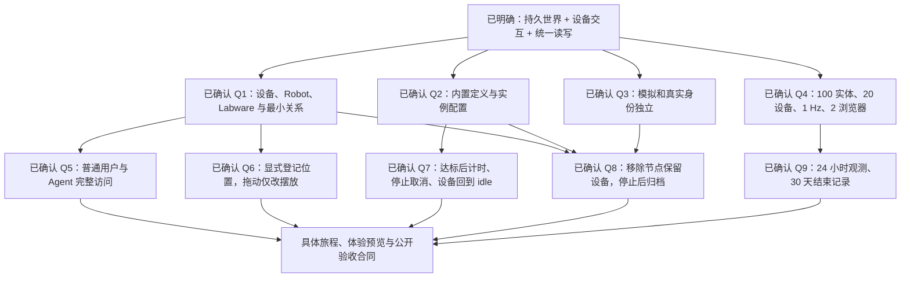

# Digital Twin Foundation V1 计划审阅

日期：2026-10-02。对象：[Labworld Digital Twin Foundation V1](../plans/Labworld-Digital-Twin-Foundation-V1-plan.md)。基线：`main` 的 `55a27be`，结合当前工作区未提交的计划、术语与 ADR。方法：静态核对代码、既有验收记录、三份 draft 的相关构想和前序方案；本次未重新运行应用或测试。

本文件保留初审与决策收敛过程。后续预览已获用户接受，规格与实施票已发布；当前实施入口见[开发交接](../handoffs/digital-twin-foundation-v1.md)和 [GitHub 规格 #1](https://github.com/CaiZongyuan/labworld/issues/1)。早期阶段草稿在交接整理时移除，已确认的决定保留在计划与 ADR 中。

结论：产品方向成立。两轮讨论已将世界范围、定义与实例、模拟/真实身份、统一读写、设备任务、历史保留和参考负载收敛到原计划，并补上公开行为与失败验收。方案可以进入交互体验与纵向实施设计；合同通过第一条完整链路验证后再扩大并行。

2026-10-02 首轮回复：用户回答“都按你的推荐”，确认 Q1–Q4。第二轮用户明确普通用户和 Agent 都可 full access，并接受 Q6–Q9 推荐。决定已写入原计划与 CONTEXT；模拟/真实身份记为 [ADR 0007](../adr/0007-separate-simulated-and-physical-entity-identities.md)，完整 Lab 访问记为 [ADR 0008](../adr/0008-full-lab-access-for-users-and-agents.md)。下文保留初审问题及其收敛依据，当前决定以原计划与文末轮次记录为准。

## 判断依据与已有决定

- 最新计划明确递延真实协议、ROS 控制、物理仿真、LabIR 和完整安全运行系统。这与整体构想的分阶段建设相容，不能因为 draft 描述了完整远景，就要求 V1 全部交付。
- [ADR 0005](../adr/0005-lab-digital-twin-on-saas-foundation.md)规定 Lab 业务归属与 SaaS 底座复用；[ADR 0006](../adr/0006-server-owned-virtual-device-programs.md)已确认内置后端设备程序、实例独立、关闭浏览器继续运行、后端重启标记中断并由用户显式重启。这些应直接继承。
- 四类已确认行为是持续采样、即时控制、温控渐变和仪器长任务。新计划中的离心机可以同时验证温控渐变与长任务；不必机械增加第四款设备，但应明确测量温度逐步变化并验证同类实例隔离。
- 早期方案提出过样品/物料全部进入首期、ractor/jsonschema 和 Agent 首个只读接入等建议。这些未采纳部分不构成当前实施约束；已批准范围以 GitHub 规格和 ADR 为准。
- [整体构想](../draft/LabOS%20广泛检索.md)中的实体/能力与状态讨论强调对象关系、状态证据及当前可执行性；[原始素材](../draft/具身实验室教学_方案原始素材.md)中的 World Model 讨论强调统一对象身份和命令/观测两条路径。这些有助于审视模型边界，文中外部产品的能力与兼容性声明未在本轮重新核验。

## 实际起点

| 范围           | 当前代码事实                                                                                                                                        | 对本计划的影响                                                     |
| -------------- | --------------------------------------------------------------------------------------------------------------------------------------------------- | ------------------------------------------------------------------ |
| 导入与资产管理 | [catalog.ts](../../packages/views/src/lab/catalog.ts)第 51–99 行将目录与本地 `File` 保存在用户身份下的 React Query 内存中                           | 已有会话内导入与管理；自定义资产跨刷新、跨浏览器恢复需要新增持久化 |
| 三维展示       | [lab-view.tsx](../../packages/views/src/lab/lab-view.tsx)第 55–63 行选择一个 activeAsset，选择状态为 boolean                                        | 多 Entity 选择、布局、场景绑定和保存均是新增能力                   |
| 后端业务       | [模块组装](../../crates/app/src/modules/mod.rs)与 [API 组装](../../apps/api/src/lib.rs)尚无 Lab 业务模块/路由；已有身份、数据库、文件与任务基础设施 | 可以复用平台能力，但没有现成 World/Asset/Runtime API               |
| Agent 身份     | [API key 认证](../../crates/app/src/modules/api_keys/authentication.rs)第 52–59 行提供带 scope 的读取认证，并要求资源方另查权限                     | Lab 读取、控制和订阅授权需要业务合同                               |
| 契约与性能     | 已有 [契约生成](../../scripts/generate-contracts.mjs)、[包体预算](../../scripts/perf/baselines.json)和 [Lab E2E](../../tests/e2e/lab.spec.ts)       | 可复用工程工具；没有多实体世界与状态更新的现成性能保证             |

初审时产品架构页的“正式 Lab 待接入”等描述落后于代码及[查看器验收记录](2026-10-02-lab-viewer-implementation.md)；交接整理已更新[产品架构页](../architecture/lab-word.md)。已有查看器工作应作为复用基线。

## 需要补强的合同

### 1. Asset 升级为数字定义后，必须区分定义、表示与实例

位置：计划 §2、§3、§15 Demo 1。

把资产库发展成可复用数字定义目录是合理的产品升级。但当前 [CONTEXT](../../CONTEXT.md)第 31–44 行仍将 Asset Library 定义为三维资产集合，并已区分 Equipment Model、Equipment Instance 和 Scene Node。需要明确新 Asset 如何容纳既有 Equipment Model，以及哪些内容可以独立变化。

具体反例：两个离心机实例引用同一个 Asset；修改其最大转速、动作参数或 GLB 后，正在运行的任务是否自动改变含义？换外观是否同时改变设备程序？如果回答留给不同分支，Asset、Runtime 与 UI 会实现不同继承规则。

建议在领域上区分：可复用且有版本的能力/状态定义、可替换的三维表示、实例配置、设备程序实现。实例与运行应能追溯实际使用的定义版本；共享定义更新不应静默重写既有实例。用户是否能自行编辑能力与状态 schema，还是先使用与内置程序对应的模板，是首轮范围问题。

这不要求将每个概念拆成独立服务、数据库表或页面。新术语含义确认后再更新词汇表。

### 2. Entity 扩展对象范围，不能吞掉 Scene Node 与业务位置的区别

位置：计划 §2 的房间/工作台/Labware、§3 的 placement、§8 的对象选择。

设备实例与场景节点独立，已有词汇表可以直接继承。需要继续说明：Entity 是否是包含设备、家具、容器等对象的通用身份；Device 是否只是其中的设备类别；Lab 与作为资产实例出现的房间分别代表什么。

建议静态对象可以没有 Runtime Binding、观测或控制能力；对象登记也不应被“必须先有 GLB”限制。一个对象可被多个节点表示，删除节点、替换外观、复制摆放和创建新设备实例应各有明确行为。

三维位置还需区分两件事：显示节点的变换，以及“培养瓶登记在离心机槽位”这样的业务关系。拖动图形不能自动成为真实物料已搬运的证据。单位、坐标系、父子变换和人工登记来源要明确；细节可由开发者沿既有约定设计。

整体构想包含样品、容器、耗材与关系，本计划主要演示设备世界。需要确认 V1 的最小关系范围，而非默认把旧方案里的全部对象搬进本版。

### 3. 五个主轴概念不足以解释一次可靠设备操作

位置：计划 §4、§5、§10 Centrifuge、§15 Demo 4–5。

Command、Observation、设备程序运行、一次仪器任务及 Result 只在示例中零散出现。它们需要明确关系，否则实现可能将“按钮成功”“设备开始执行”“设备达到目标”“任务结束”合成一个状态。

应把以下规则写入验收：

- 命令表达请求和执行结果；当前设备状态来自来源明确的观测。命令成功不直接把测量温度改成目标温度。
- 相同请求重试不重复启动离心任务；并发 Start、忙碌状态、错误参数与 Stop 都有确定结果。
- 设备程序的一次运行与一次离心任务具有不同生命周期。关闭页面继续运行；后端重启按 ADR 0006 标中断并保留记录。
- 离心机任务可以 completed，同时设备回到 idle。设备的运行状态与任务的结束结果应分别表达，才能开始下一次任务。
- 超时或响应丢失不能无依据地判成未执行，再自动发起第二次动作。

现有 Device Program 已指设备行为实现。“12000 rpm、4℃、10 min”的参数组合若也叫 Program，需要另定清晰名称，避免与内置设备程序混用。

### 4. Capability 需要说明含义、实现状态与当前可用性

位置：计划 §4、§10 Robot、§12、§15 Demo 6。

动作名有利于发现，但 `centrifuge.run` 本身不足以让调用方理解参数单位、合法范围、异步结果和停止方式。更具体的问题是 Robot 声明 move/pick/place，却只承诺展示抽象：查询“哪些对象可以 pick”时，不能把它当成已经可以执行的机器人。

最小能力合同包含标识、版本、说明、参数类型/单位/范围与结果含义，并区分“定义上支持”“当前绑定已实现”“现在可执行及原因”。静态描述、离线、忙碌和未实现应可辨认。按第二轮 Q5，所有已认证普通用户及 Agent 拥有完整 Lab 操作能力，后端校验身份和相同业务约束。

本版无需实现任意能力编辑器，也不必替未来机器人承诺通用运动语义；是否让用户编辑定义属于首轮待定范围。

### 5. “同一个 World”需要更新与失效规则

位置：计划 §5 的“尽量保留”、§6 Binding、§9、§11。

建议将观测的来源、观测时间、接收时间及质量明确为最低合同，无法取得的来源时间应显式未知。新鲜度按属性或具有相同采样边界的一组属性判断；新的心跳不能让旧温度重新变新。

快照与实时更新必须有可恢复的衔接规则：迟到报告不回退当前状态，重复报告不刷新新鲜度，部分报告不抹掉其他属性；旧运行或旧 Binding 的消息不能覆盖新来源。重连补齐最新快照，慢客户端积压有界。存储事实、通知和查询应使用可比较的版本；人和 Agent 可以有传输延迟，不能产生相互独立的权威状态。

绑定也不能仅是 `Simulator/MQTT/...` 枚举：至少需要解释来源身份、生命周期和能力适配。建议将“换成实机后复用上层合同”与“同一 Entity 在线切换模拟/真实身份”分开讨论。后一种承诺影响历史、来源和在途命令，需要明确产品选择。

这些是可观察行为；SSE/WebSocket、队列、事务及前端订阅实现仍可由开发者选择。

### 6. 刷新恢复必须包含资产资源及共享编辑语义

位置：计划 §8、§15 Demo 2。

当前会话中的本地 File 无法仅凭 asset_id 在另一个浏览器恢复。若本版演示包含用户导入的资产，就必须持久保存文件及元数据；若先只用随版本发布的预置资产验收，应把限制写明。复用已有文件基础设施，不等于已有持久资产库。

还需明确删除被引用资产、替换表示及两个浏览器同时保存布局时的可观察结果。建议拒绝静默覆盖并保留用户未保存的修改。布局保存不应覆盖运行时正在产生的观测。

此前资产库转换如由另一项工作交付，应以其实际可复用提交作为依赖，避免重复开发；本次核对的分支尚未具备该持久化能力。

### 7. 演示链应覆盖失败、权限和实际三维资产条件

位置：计划 §15、§16。

六个 Demo 给出了有用的主旅程，但完成条件还需要以下可观察情形。它们随对应能力交付，不集中拖到最后的 Validation workstream。

| 场景                          | 验收结果                                                                            |
| ----------------------------- | ----------------------------------------------------------------------------------- |
| 两个同类实例共用三维模型      | 操作 A 不改变 B 的配置、观测或可变材质                                              |
| 初次登记 / 停止来源           | 未观测显示未知；最后数值带来源与时间，并按规则过期                                  |
| 重复 Start / 忙碌 / 无效身份  | 请求得到明确结果，不重复运行，不伪造观测                                            |
| 关闭浏览器 / 后端重启         | 前者继续运行；后者保留记录并将原运行标中断                                          |
| 两浏览器观看 / 断线重连       | 同一版本表达相同事实，断线可辨认，恢复后无旧值倒灌                                  |
| 自定义资产保存 / 布局保存冲突 | 已纳入持久范围的文件与对象可恢复；冲突不静默吞掉编辑                                |
| 外部客户端调用 World API      | 普通用户与有效 Agent 凭据均能读取、编辑和控制同一世界，获取相同事实；无效身份被拒绝 |

第二轮 Q5 已将 Agent 验收明确为完整 Lab 读写与控制，覆盖创建/配置对象、登记关系、Start/Stop 和结果查询；此前的 Agent 只读建议不再适用。Agent 通过实际 HTTP/工具接口消费同一业务能力，无需另建 Agent Runtime。

三维演示还有资源前置条件：当前仅有显微镜预置资源，[模型加载接口](../../packages/views/src/lab/model-loader.ts)第 30–35 行提供场景和几何统计，不具备离心机转子语义。若 Demo 4 的 Rotor 是必交付，应准备可辨认的转子节点、正确旋转轴和显示映射。任意静态 GLB 不会自动提供这些信息。它证明状态驱动表现，不证明物理仿真正确。

### 8. 性能与并行开发需要一个经过端到端验证的起点

位置：计划 §13、§18–21。

状态与渲染分离、服务端传语义量、客户端计算帧动画、按测量优化，均应保留。尚缺 V1 的场景与负载：Entity/可见节点数、独立模型数和资源大小、运行设备数、观测频率、并发客户端及历史窗口。“大型”和“高频”无法形成验收。

首轮可讨论单 Lab 100 个 Entity、20 个运行设备每秒一次语义更新、2 个浏览器的参考负载；这只是范围建议，不是现有性能保证。确认负载后再确定快照/分页/单次更新字节上限、查询次数与订阅积压上限，复用已有确定性预算。FPS 与延迟在注明硬件、资产和浏览器的环境中报告。

计划 §19 按可观察能力切票的原则正确。§20 的共享 Contract 应在第一条完整链路中验证后再扩大并行：持久资产/实例、一个最小场景、两个独立照明实例、命令与观测、UI 与结构化查询。接口草稿可以先写，接口是否足够应由实际行为验证。

Asset Foundation、Runtime、Realtime、World API 等可用作组织视角，不宜直接等同于几张长期横向大票。依赖、生成契约、迁移与可复用提交继续遵循[仓库开发流程](../agents/development-flow.md)。新增搭建、Inspector 和运行反馈按[体验设计流程](../agents/experience-design.md)形成版本化预览；已接受的查看器视觉方向可以复用。

## 当前决策树

已确定的根目标：可以搭建和保存、通过后端虚拟设备交互、人和 Agent 共同读写同一世界。两轮九项决定均已收敛，当前没有阻塞本轮计划审阅的产品问题。传输协议、数据库结构和状态管理库由实施者选择；具体页面体验随后由版本化预览表达。

## 第一轮：已确认

用户统一接受以下推荐，保留原问题便于追溯。

**Q1 — 世界范围**：V1 聚焦设备、Robot 和 Labware 的可运行场景，还是还要完成“样品在容器中、容器在槽位”等实验业务关系？

已确认：首版包含设备、Robot、Labware 与最小位置/包含关系，例如烧杯登记在工作台上；样品管理和物料账本后置。静态对象允许没有控制能力或运行 Binding。

**Q2 — 定义能力**：已有内置程序的前提下，用户在 V1 是选择程序对应的设备定义并配置实例，还是能够自行编辑任意能力/状态 schema？

已确认：交付与内置程序对应的定义，用户可以导入外观、配置参数、创建实例；通用语义定义编辑器后置。定义与实例建立版本关系，已有实例不被共享定义的后续编辑静默改写。

**Q3 — 模拟与实机身份**：未来接实机时，是共用定义但分别登记模拟/真实 Entity，还是把同一 Entity 从模拟来源切换成真实来源？

已确认：共用定义和访问合同，模拟与真实实例保留独立身份并可建立关联。V1 不设计同一 Entity 从模拟到真实的身份切换；见 ADR 0007。

**Q4 — 首版规模**：V1 需要按怎样的实体数、运行设备数、更新频率和观看人数设计参考场景？

已确认：单 Lab 100 个 Entity、20 个运行设备各 1 Hz、2 个浏览器，同时记录模型资源体量。这是参考负载，具体性能预算与测量仍需建立。

## 第二轮：已确认

已补查当前代码：企业角色为 Owner/Admin/Member；只读 API key 可复用 scope 与有效成员校验，但业务资源授权需由 Lab 实现。当前没有布局编辑、Asset 引用删除保护或设备历史保留策略；已有审计/任务分页习惯可供实施参考。事实来源是 [Organization](../../crates/app/src/modules/organization/mod.rs)、[API key 认证](../../crates/app/src/modules/api_keys/authentication.rs)、[文件清理](../../crates/app/src/modules/files/cleanup.rs)与[审计查询](../../crates/app/src/modules/audit/management.rs)。

用户明确：“q5 不用搞复杂的权限控制，agent，普通用户都可以full access。 q6 剩下都按照你的建议”。Q5 按用户修正收敛，Q6–Q9 接受推荐。

**Q5 — 操作权限**：谁可以搭建 Lab、修改设备配置和发出命令？Agent 首版是否也能控制设备？

已确认：V1 的 Lab 在企业内共享，通过认证的普通用户与 Agent 均可完整读取、编辑和控制，不按角色分级，也不建设逐 Lab 授权管理。两类入口使用同一业务操作与规则，记录操作者；见 ADR 0008。

实施事实补充：现有 `require_read` 的会话分支不做写入 CSRF 检查，不能直接作为写认证；现有业务写入也没有 Bearer key 接入先例。Lab 写入口需分别沿用会话写认证和有效 API key 校验，再进入同一业务逻辑，无需新增角色分级。证据见 [API key 认证](../../crates/app/src/modules/api_keys/authentication.rs)第 54–107 行、[会话认证](../../crates/app/src/modules/identity/mod.rs)第 501–545 行以及[已有业务 key 测试](../../apps/api/tests/key_documents.rs)第 170 行。

**Q6 — 位置关系**：把烧杯图形拖到另一张工作台上，是否同时改变其登记位置？

已确认：普通拖动只改变三维摆放；显式“放到某位置”或 Inspector 中选择位置才改变位于/包含关系，并注明人工登记来源。几何重叠不自动推断包含关系。

**Q7 — 离心任务规则**：10 分钟从何时计时，运行中能否改参数，Stop 应得到什么结果？

已确认：转速和温度进入设备程序定义的目标容差后开始计时，加速/准备和减速不计入该时长；本次任务固定提交时的参数，忙碌时拒绝第二次 Start，运行中保留 Stop。Stop 经减速后将任务记为 cancelled；正常完成同样减速并回到 idle，命令接受与任务结束分别展示。此规则描述虚拟示例，不宣称与特定型号实机一致。

**Q8 — 移除与归档**：用户不再需要一个对象或资产时，如何处理正在运行的设备、场景引用和记录？

已确认：从场景移除只删除节点表示，设备继续存在；归档设备前须结束其任务并停止设备程序，归档后不能再发动作，但身份与尚在保留期内的记录可查。被引用资产禁止直接删除，先解除引用；设备定义与程序的更换也须在停止后进行。V1 不提供有记录对象的彻底删除。

**Q9 — 历史回看**：V1 的观测、事件与任务记录需要保留多久？

已确认：原始观测保留最近 24 小时，已结束的命令、任务及设备事件保留 30 天，并可由部署配置调整；未结束任务以及设备身份、配置、最后观测不因这些历史期限被删除。查询有时间范围、分页和载荷上限，过期数据的缺口明确显示。仍需按已确认参考负载测量实际容量。

## 文档收敛位置

原计划已保留产品叙述与六个 Demo，并补齐实际基线与持久资源范围、概念关系、Command/Observation/任务生命周期、普通用户与 Agent 完整操作、失败验收、历史期限、参考负载与接受的 ADR。交互体验已接受，正式实现仍需完成契约生成与应用验证；本报告不将方案决定表达成已实现功能。

CONTEXT 已记录 Asset、Entity、关系、资产表示、设备实例与场景节点，以及第二轮明确的登记位置、三维摆放、设备程序运行、设备任务、能力、运行绑定与归档对象。ADR 0007 记录身份取舍，ADR 0008 记录完整 Lab 访问。产品名称沿用既有 glossary 的 Lab Word，计划文件原名保留；数据库结构、运行库、传输协议和状态管理库由实施者按证据选择。
